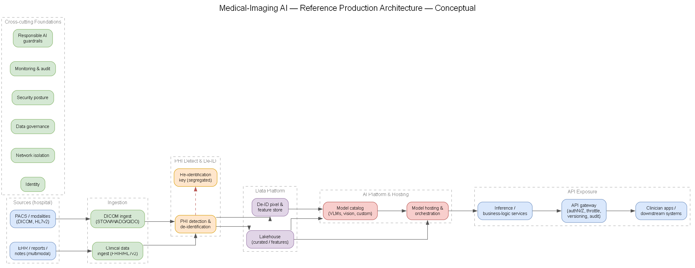
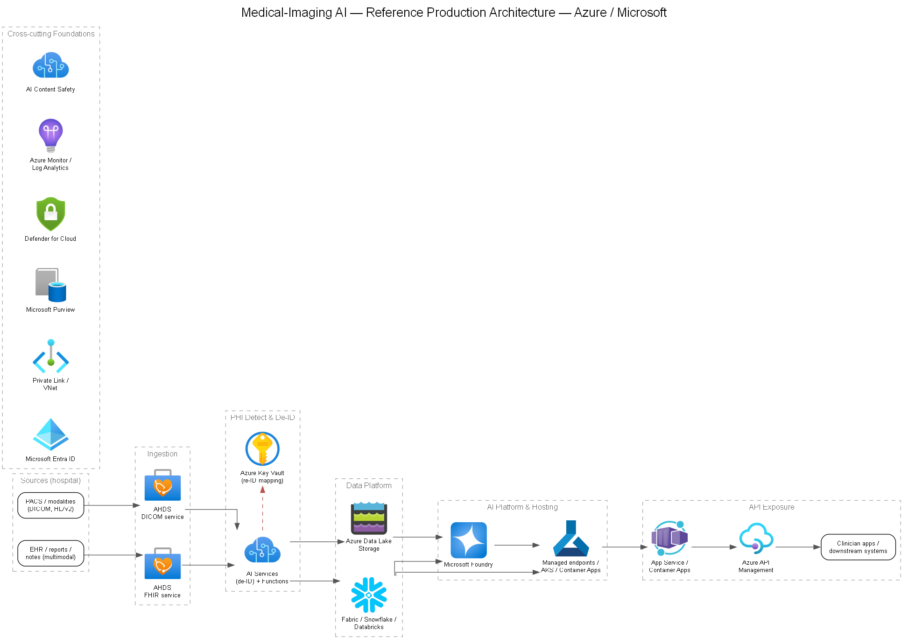

# 01 — Reference Production Architecture

End-to-end target architecture for operationalizing Company's medical-imaging AI. This is the "whiteboard made durable" — the constituent pieces a partner SOW must cover.

## Logical flow

**Conceptual (vendor-neutral):**

**Azure / Microsoft services:**

> Diagrams are generated from [`diagrams/reference-architecture.yaml`](./diagrams/reference-architecture.yaml). Edit the spec and re-render — see [`diagrams/README.md`](./diagrams/README.md). Editable draw.io starters live alongside the PNGs.

## Architecture summary

The proposed platform separates the workload into three major planes:

1. **Clinical data plane** — receives DICOM and clinical context, contains the minimum possible PHI footprint, and produces governed de-identified data products.
2. **AI and application plane** — hosts approved models and deterministic orchestration, exposes versioned inference capabilities, and returns assistive results for human review.
3. **Management and governance plane** — provides identity, policy, private networking, secrets, lineage, security posture, telemetry, evaluation evidence, and audit across the other planes.

The primary architectural rule is that raw PHI does not move directly from a source system to a model. It first crosses a controlled ingestion boundary, is scanned and transformed across all three PHI surfaces (DICOM tags, burned-in pixels, and free text), and is promoted only after the de-identification policy succeeds. The model and analytics estate therefore operates on de-identified data by default. Any workflow that legitimately requires identifiable data must be explicitly approved and remain inside the production PHI boundary.

The architecture supports two workload shapes. **Interactive clinical inference** is latency-sensitive and follows a synchronous or short-running asynchronous path from an authorized application through the API gateway to orchestration and model endpoints. **Research, evaluation, and batch inference** are throughput- and cost-oriented and consume immutable, de-identified datasets from the data platform. Both paths use the same approved model registry, evaluation gates, lineage, and audit controls. Rather than branching on payload type alone, requests are **routed by workload contract** — latency SLA, payload composition (image, image+text, image+text+tabular), model and compute requirement, request size, and tenant — which resolves each request to a processing graph and an eligible backend class. See [`docs/07`](./07-payload-processing-backend-alignment.md) and **[DEC-07](../decisions/DEC-07-backend-alignment.md)**.

## Trust zones and data states

| Zone | Purpose | Permitted data | Principal controls |
| --- | --- | --- | --- |
| **Hospital / source** | PACS, modalities, EHR, reports, and existing clinical applications | Identifiable clinical data | Hospital access controls; encrypted private connectivity; optional on-premises de-ID |
| **Azure PHI ingestion zone** | Receive, validate, quarantine, and de-identify incoming data | Raw and partially processed PHI | Dedicated production boundary; private endpoints; least-privilege RBAC; encryption; short retention; complete access audit |
| **Re-identification boundary** | Preserve longitudinal linkage when the use case requires pseudonymization | Surrogate-to-identity mapping only | Separate Key Vault/subscription where appropriate; PIM and break-glass access; no model access; immutable audit |
| **De-identified data zone** | Curate reusable data products for inference, evaluation, and analytics | De-identified images, references, metadata, text, labels, and features | Data contracts; catalog and lineage; immutable dataset versions; zone-level access controls |
| **AI serving zone** | Execute approved domain models, custom models, and VLM workflows | De-identified inputs by default; transient request context | Private model endpoints; managed identity; egress controls; model and prompt versioning; output validation |
| **Application / API zone** | Integrate clinician applications and downstream systems | Request metadata and governed results | Entra OAuth2/OIDC; APIM policies; WAF where public ingress is required; throttling; tenant and role scoping |
| **Operations zone** | Centralize monitoring, security, governance, and audit | PHI-scrubbed telemetry plus protected audit events | Azure Monitor, Log Analytics, Purview, Defender for Cloud, retention policies, restricted audit access |

Promotion between zones is policy-driven rather than a simple file copy. Each object carries a processing status, source identifier, de-identification policy version, validation result, and lineage identifiers. Failed or ambiguous items remain quarantined and cannot be consumed by downstream AI jobs.

## End-to-end operational flow

### 1. Source connectivity and ingestion

PACS and imaging modalities send studies through DICOMweb STOW-RS. Where a source only supports DICOM C-STORE, an on-premises or landing-zone DICOM router translates the protocol. The recommended system of record for operational images is **Azure Health Data Services (AHDS) DICOM service**, which also supports WADO-RS retrieval, QIDO-RS query, and a change feed for downstream processing. It additionally emits **Event Grid** events (for example `DicomImageCreated`) that can trigger downstream processing without requiring every workload to originate as an explicit API call.

EHR data enters as FHIR R4 or HL7v2. Native FHIR is stored in the **AHDS FHIR service**; HL7v2 feeds arrive through an MLLP listener and are converted to FHIR with governed mappings. Reports, notes, labels, and historical extracts use controlled API, SFTP, or batch paths. Production connectivity uses ExpressRoute where volume and availability justify it, with site-to-site VPN as an alternative.

Every ingestion path is idempotent. DICOM instances are deduplicated by SOP Instance UID, requests carry correlation identifiers, and a queue decouples arrival from processing so temporary downstream failures do not force the hospital to resend an entire study. Poison messages and validation failures move to a dead-letter or quarantine store with reconciliation reporting. See [`docs/02`](./02-data-ingestion-pacs-dicom-multimodal.md), [`docs/12`](./12-health-data-services-fhir-dicom.md), and **[DEC-02](../decisions/DEC-02-dicom-ingestion.md)**.

### 2. PHI detection, de-identification, and linkage

An event from the ingestion layer starts the de-identification pipeline. The pipeline applies a versioned policy to:

- redact or replace identifying DICOM metadata according to the selected DICOM PS3.15 profile;
- detect and mask burned-in identifiers in pixel data, with modality-specific handling and human review for high-risk cases;
- detect and transform PHI in reports, notes, and other free text; and
- create stable surrogate identifiers so images, reports, and clinical context remain linkable after de-identification.

The pipeline records which policy and detector versions were used and whether each stage passed. Recall and precision are measured against labeled validation samples; a policy or detector update is treated as a governed model change. If reversible pseudonymization is required, the identity mapping is written to the segregated re-identification boundary. Inference services receive only the surrogate identifier and have no permission to resolve it. See [`docs/03`](./03-phi-detection-deidentification.md) and **[DEC-03](../decisions/DEC-03-phi-deidentification.md)**.

### 3. Governed data platform

Successfully de-identified products are promoted into a medallion-style lakehouse. The restricted bronze layer may contain short-lived raw payloads inside the PHI boundary. Silver contains cleaned, conformed, de-identified study metadata, reports, and derived features. Gold contains approved labels, feature views, evaluation cohorts, and analytics-ready datasets.

Large image binaries remain in the DICOM service or object storage; lakehouse tables hold references, normalized metadata, embeddings, features, labels, and processing state. This avoids unnecessary duplication and lets storage, metadata processing, and GPU workloads scale independently. **Microsoft Purview** catalogs and classifies assets and captures source-to-dataset-to-model lineage.

Every training or evaluation run pins an immutable dataset version. The resulting chain — source study, de-identification policy, dataset version, model version, prompt/orchestration version, evaluation run, deployment, and prediction — provides reproducibility and supports incident investigation. See [`docs/04`](./04-data-platform-design.md) and **[DEC-04](../decisions/DEC-04-data-platform.md)**.

### 4. Model training and adaptation

Most models reach the registry by adapting existing medical foundation models rather than training from scratch. Training and fine-tuning jobs read exclusively from immutable, de-identified gold datasets that join image pixels, normalized DICOM metadata, and report text; raw PHI-bearing data is never a training input. The preferred path adapts imaging foundation models — for example MedImageInsight, MedImageParse, or CXRReportGen from the Foundry catalog — using lightweight adapter or LoRA training when labeled data is limited, full fine-tuning when it is not, and multimodal fusion of image, metadata, and text where clinical context improves accuracy. Custom models are trained from scratch only when no suitable foundation model exists and the data volume justifies the cost.

Training runs on **Azure Machine Learning** with GPU compute sized to the method and selected in **[DEC-06b](../decisions/DEC-06b-compute-gpu.md)**. Every run logs parameters, metrics, the pinned dataset version, code commit, and environment, and produces a versioned artifact in the model registry with full source-to-dataset-to-model lineage. Dataset splits are made at the patient level to prevent leakage across train, validation, and test, and a frozen test set is pinned per run. A trained candidate is not promoted for serving until it clears the evaluation and safety gate. See [`docs/05`](./05-model-training.md) and **[DEC-05](../decisions/DEC-05-model-training.md)**, with dataset lineage from [`docs/04`](./04-data-platform-design.md) and evaluation in [`docs/13`](./13-evaluation-practices.md).

### 5. AI platform and model lifecycle

**Microsoft Foundry** provides the model catalog, evaluation and tracing capabilities, and access to approved managed models. The platform accommodates three model classes without forcing them onto one runtime:

- managed frontier vision-language models are consumed through private, governed model APIs;
- domain-specific medical vision and embedding models run on managed or dedicated GPU endpoints; and
- Company's validated hip-and-knee models are packaged as versioned containers and served through Azure Machine Learning managed online endpoints, AKS, or Container Apps, as selected in **[DEC-06a](../decisions/DEC-06a-model-hosting.md)**.

The model registry is the source of truth for artifact version, container and dependency versions, dataset lineage, evaluation evidence, approval state, and deployment history. A candidate cannot be promoted until it passes technical, safety, and clinical-quality thresholds. Deployment uses shadow, canary, or blue/green patterns; traffic is shifted only after health and quality checks pass, and rollback points to the last approved version rather than rebuilding it. GPU and managed-model capacity are selected separately for interactive and batch workloads; see **[DEC-06b](../decisions/DEC-06b-compute-gpu.md)** and [`docs/18`](./18-readiness-model-access-quota.md). Across multiple health-system tenants, backend capacity is **pooled by workload class** — real-time GPU/CPU, batch GPU/CPU, and managed-model quota — rather than provisioned per customer, with tenants isolated through quotas, priorities, and concurrency limits and dedicated capacity reserved only where contractual isolation requires it. See [`docs/07`](./07-payload-processing-backend-alignment.md) and **[DEC-07](../decisions/DEC-07-backend-alignment.md)**.

### 6. Inference orchestration and human review

The business service resolves an authorized study reference, retrieves only the data required for the task, and invokes an explicit orchestration graph. The orchestrator acts as the **workload router**: a small application function normalizes each request — whatever arrives via APIM, Event Grid, or Service Bus — into a common internal workload descriptor (tenant, mode, payload, task, SLA, pipeline, priority, callback), then resolves the required processing graph and selects an eligible backend from a **model capability registry** rather than embedding endpoint URLs or acting as the compute scheduler itself. Application-level routing stays in this service, not in gateway policies. A typical flow performs input validation, image preprocessing, anatomy or study routing, calls one or more specialized vision models, optionally grounds a VLM with approved clinical context, combines outputs, applies confidence and content-safety checks, and produces a schema-validated result.

Clinical steps remain deterministic where possible. Tool inputs and outputs are validated, retries are bounded, timeouts and circuit breakers protect dependencies, and uncertain or conflicting results fail closed to manual review. Agentic orchestration may coordinate model tools, but it does not autonomously write a diagnosis or order into a clinical system. A clinician reviews and accepts, edits, or rejects the assistive output; that action becomes part of the prediction audit record. Framework selection remains in **[DEC-14](../decisions/DEC-14-orchestration-framework.md)**. See [`docs/06`](./06-model-hosting-orchestration.md) and [`docs/14`](./14-agentic-orchestration.md).

### 7. API exposure and clinical integration

**Azure API Management (APIM)** is the controlled front door for inference and business APIs. Entra ID authenticates workforce and workload callers, while OAuth scopes, app roles, and tenant claims authorize access to studies and operations. APIM applies schema validation, request-size limits, rate limits, quotas, API versioning, correlation identifiers, and audit policies. Backends are reached through private networking using managed identities rather than shared credentials.

Interactive clients use synchronous REST only when the end-to-end latency target can be met. Long-running or batch requests use a job resource with status polling or an approved callback, preventing gateway timeouts and making retries idempotent. Results intended for clinical systems are expressed as stable, structured contracts and can be mapped to FHIR `DiagnosticReport`, `Observation`, and `ImagingStudy` references. No PHI is placed in URLs, query strings, or general application logs. See [`docs/09`](./09-api-exposure.md) and **[DEC-09](../decisions/DEC-09-api-exposure.md)**.

### 8. Observability, audit, and feedback

Application Insights distributed tracing follows a correlation identifier from APIM through orchestration and model calls without recording image pixels, prompts containing PHI, or raw clinical payloads. Azure Monitor and Log Analytics collect availability, latency, error, saturation, queue depth, GPU utilization, quota consumption, and dependency health. Foundry tracing and evaluation telemetry add model latency, token consumption, tool calls, quality scores, content-safety signals, and drift indicators.

Audit events are distinct from diagnostic logs and use restricted access and retention appropriate to the regulatory requirement. They answer who accessed a study, which de-identification and model versions ran, what result was produced, and who reviewed or re-identified it. Human corrections feed a governed labeling process; they do not automatically retrain or modify a production model. See [`docs/10`](./10-monitoring-observability.md), [`docs/11`](./11-governance-compliance.md), and **[DEC-10](../decisions/DEC-10-observability-stack.md)**.

## Cross-cutting foundations

| Concern | Azure service | Notes |
| --- | --- | --- |
| Identity | **Microsoft Entra ID** | Workforce and workload identities; managed identities by default; PIM for privileged roles; no keys in code. |
| Network isolation | **Private Link / Private Endpoints, VNet** | PaaS data planes reached privately; controlled DNS and egress; no public exposure for PHI services. |
| Secrets and keys | **Azure Key Vault** | Certificates, secrets, and encryption keys; RBAC, soft delete, and purge protection. Re-ID mappings use a separate boundary. |
| Data governance | **Microsoft Purview** | Catalog, lineage, classification, sensitivity labels. |
| Security posture | **Azure Policy + Defender for Cloud** | Prevent configuration drift; CSPM and workload protection; regulatory compliance dashboard. |
| Logging and audit | **Azure Monitor + Log Analytics** | Diagnostic settings on every resource; PHI-safe telemetry; protected, retained audit records. |
| Responsible AI | **Foundry evaluations + Azure AI Content Safety** | Quality and safety gates, structured outputs, grounding controls, and human review. |

## Deployment topology

The platform is deployed into an **Azure landing zone** with management-group policy, centralized identity and security controls, and hub-spoke networking. The hub provides approved connectivity, DNS, firewall/egress inspection, and shared operations services. Workload spokes isolate the PHI ingestion/data services, AI compute, and application/API tiers. Private DNS zones resolve private endpoints consistently from Azure and the hospital network.

Production should use availability zones for components that support them and zone-redundant or replicated SKUs where required by the agreed business continuity targets. Regional design is driven by data-residency rules, AHDS and model availability, GPU capacity, and recovery objectives. A secondary region is introduced only with a documented failover model that preserves data consistency, private connectivity, model artifacts, and re-identification controls.

Infrastructure and policy are deployed through version-controlled infrastructure as code. Application, orchestration, de-identification, and model artifacts move through build, security scan, evaluation, approval, and deployment stages. Production changes require separation of duties and leave a traceable release record.

## Reliability and failure behavior

- **Ingestion interruption:** buffer messages, retry with exponential backoff, and reconcile by source identifiers; do not silently drop studies.
- **De-identification uncertainty:** quarantine the item and require review; never promote on a partial pass.
- **Model or quota failure:** use bounded retries and circuit breakers, route to an approved fallback only when clinically valid, otherwise return a clear unavailable/manual-review state.
- **Orchestration timeout:** persist job state for safe resume or fail the request without partial clinical output.
- **Dependency degradation:** expose health signals and protect upstream systems with backpressure and rate limits.
- **Deployment regression:** stop traffic shift automatically and roll back to the last approved model and application versions.
- **Regional outage:** execute the documented recovery runbook and verify data, identity, private DNS, model, and audit dependencies before reopening traffic.

Recovery time objectives, recovery point objectives, availability SLOs, maximum acceptable inference latency, and batch completion targets are business requirements to be agreed with Company and captured in the partner SOW.

## Environment and data separation

Use separate subscriptions or equivalent strong boundaries for `dev`, `test/validation`, and `prod`. Each environment has independent identities, private endpoints, secrets, model deployments, data stores, and telemetry destinations. De-identified, representative datasets may be promoted to lower environments through an approved process; raw production PHI and production re-identification mappings do not leave the production boundary.

Synthetic data supports routine development and end-to-end health probes. Access is group-based and time-bound where privileged, with production operator and developer duties separated. Deployment pipelines promote immutable artifacts rather than rebuilding them per environment.

## Key assumptions and decisions still to close

This is a proposed target architecture, not evidence that every product choice has been approved. The following items materially affect sizing, cost, compliance, and the partner SOW:

- location of de-identification and the required anonymization or pseudonymization standard;
- DICOM, lakehouse, training-approach, model-hosting, GPU, VLM, orchestration, API, and observability product selections in the linked decision records;
- target regions, residency constraints, availability and recovery objectives;
- clinical workflow, human-review responsibility, and regulatory classification;
- peak study volume and size, interactive latency, batch throughput, and retention periods;
- model access, quota, provisioned throughput, and GPU capacity; and
- tenant isolation and metering requirements if the platform becomes SaaS.

These decisions should be resolved before detailed implementation design. The architecture remains intentionally modular so a decision can change a service within one layer without weakening the trust boundaries, data contracts, lifecycle controls, or audit chain.
