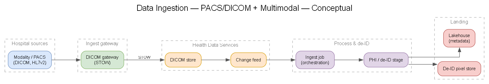
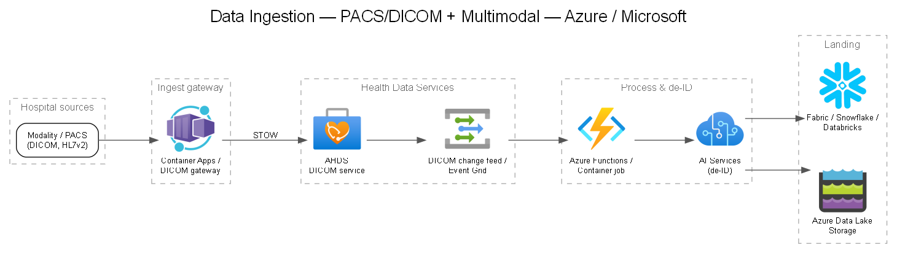

# 02 — Data Ingestion: PACS/DICOM & Multimodal

## Objective

Reliably land imaging (DICOM) and clinical/multimodal data (HL7v2, FHIR, reports, notes) from Company's hospital environment into Azure, with PHI controlled from the first hop.

## Data sources

| Source | Format | Transport | Target |
|---|---|---|---|
| PACS / modalities | DICOM | DICOMweb (STOW-RS), C-STORE via gateway | AHDS DICOM service |
| EHR / interfaces | HL7v2 | MLLP | Ingestion → FHIR conversion |
| EHR / APIs | FHIR R4 | HTTPS | AHDS FHIR service |
| Radiology reports | Text / PDF / RTF | Batch (SFTP/API) | Data platform (post de-ID) |
| Prior labels / study metadata | CSV/Parquet | Batch | Lakehouse |

## Connectivity patterns

- **ExpressRoute** (preferred for production PHI volumes) or **site-to-site VPN** for the hospital ↔ Azure link.
- A **DICOM gateway / router** on-prem (or in a landing subnet) to translate DICOM C-STORE to DICOMweb STOW-RS if modalities can't speak DICOMweb.
- **MLLP listener** (e.g., in Container Apps/AKS) for HL7v2 feeds; convert HL7v2 → FHIR.

## Imaging ingestion (DICOM)

Recommended target: **Azure Health Data Services DICOM service** (see **[DEC-02](../decisions/DEC-02-dicom-ingestion.md)**).

- Standards-based **DICOMweb**: STOW-RS (store), WADO-RS (retrieve), QIDO-RS (query).
- Change feed for downstream processing triggers.
- Integrates with FHIR via **DICOMcast** (imaging study references appear as FHIR ImagingStudy resources).

### Ingestion pipeline (event-driven)

> Generated from [`diagrams/ingestion.yaml`](./diagrams/ingestion.yaml).

## Multimodal ingestion

- **HL7v2 → FHIR** conversion (AHDS provides a `$convert-data` operation using Liquid templates).
- **Reports/notes:** land raw into a restricted PHI zone, run PHI detection/de-ID, then promote de-identified text to the lakehouse.
- Keep imaging ↔ report linkage via de-identified surrogate keys.

## Key design decisions to capture

- **[DEC-02](../decisions/DEC-02-dicom-ingestion.md)** — DICOM store: AHDS DICOM service vs. self-managed on Blob vs. partner/third-party PACS-in-cloud.
- Batch vs. streaming ingestion cadence (real-time inference vs. nightly research batches).
- Whether de-ID happens **on-prem before egress**, **at the ingestion edge**, or **inside Azure post-landing** (has PHI-residency implications — see [`docs/03`](./03-phi-detection-deidentification.md)).

## Reliability & throughput considerations

- Idempotent ingestion (dedupe on SOP Instance UID).
- Backpressure and retry (queue between gateway and processing).
- Study-size handling (large multi-frame series, tomosynthesis) — size compute for peak.
- Dead-letter + reconciliation reports for missed instances.
