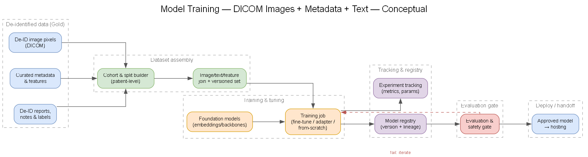
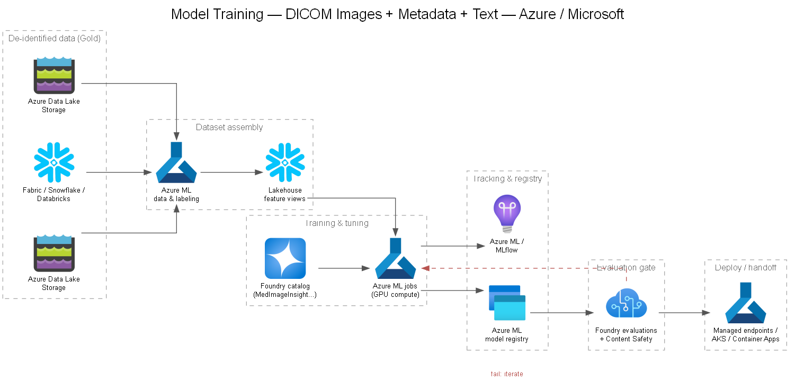

# 05 — Model Training

## Purpose

How we **train, fine-tune, and adapt** models that learn from medical imaging — the **DICOM pixel data** plus its **associated metadata** (acquisition/series/study attributes, structured findings) and **text** (radiology reports, notes, labels). This doc covers the training substrate, modeling approaches, compute, and MLOps that turn the de-identified lakehouse ([`docs/04`](./04-data-platform-design.md)) into registered, evaluated models ready for hosting ([`docs/06`](./06-model-hosting-orchestration.md)).

See **[DEC-05](../decisions/DEC-05-model-training.md)** for the training approach & platform decision (fine-tune/adapt foundation models vs. train from scratch; Azure ML vs. managed Foundry fine-tuning vs. Databricks).

## Scope

- **In scope:** supervised/self-supervised training on de-identified images + metadata + text; transfer learning and fine-tuning of medical foundation models; adapter/LoRA training; multimodal fusion; experiment tracking, model registry, lineage, and reproducibility.
- **Out of scope:** inference orchestration ([`docs/06`](./06-model-hosting-orchestration.md)), model **selection** for the catalog ([`docs/08`](./08-ai-foundry-model-strategy.md)), and evaluation methodology & gates ([`docs/13`](./13-evaluation-practices.md)) — training hands off to all three.

## Training pipeline

### Worked example — CT–report multimodal pretraining (scaffold)

A **runnable Azure ML v2 scaffold** that instantiates this pipeline for a concrete
research architecture lives in
[`prototype/model-training/ct-report-pretraining`](../prototype/model-training/ct-report-pretraining).
It emulates the two-stage volumetric CT–report transformer from *"Scaling Self-Supervised
and Cross-Modal Pretraining for Volumetric CT Transformers"* (CVPR 2026, Fig. 2):

- **Stage 1 — SSL (`L_SSL`, DINOv3-style):** the window-level `ViT_ℓ` learns localized
  features from CT window crops (`stage1_ssl_pretrain` component, GPU).
- **Stage 2 — SigLIP (`L_SigLIP`):** the vision tower (`ViT_ℓ → pool → ViT_g`) is aligned
  with a Qwen3-0.6B + LoRA text tower in a shared embedding space (`stage2_siglip_align`).

It ships as an Azure ML pipeline (`azureml/pipeline.yml`) of three components
(`prepare_data → stage1_ssl → stage2_siglip`), with compact runnable PyTorch for every
figure block (3D-RoPE ViTs, DINO + SigLIP losses) and a **CPU smoke test** on synthetic,
de-identified data. It demonstrates the training substrate below — versioned snapshot →
GPU Azure ML jobs → registered model → evaluation gate handoff.

## Training-data assembly

Training reads exclusively from the **de-identified Gold zone** of the lakehouse ([`docs/04`](./04-data-platform-design.md)); raw PHI-bearing Bronze is never used for training. Three modalities are joined at the study/series level:

| Modality | Source | Examples |
|---|---|---|
| **Image pixels** | DICOM service / object storage | Windowed/normalized pixel arrays, volumes, key frames |
| **Metadata** | Lakehouse (Fabric / Databricks / Snowflake) | Modality, body part, view position, manufacturer, acquisition params, structured findings |
| **Text** | Lakehouse Gold | De-identified reports, impressions, section labels, ground-truth annotations |

- **Feature/label views** are materialized as versioned, immutable datasets (Delta/Parquet snapshots or Snowflake/Databricks feature views) so every run is reproducible.
- **Label & ground-truth management:** labels come from report-derived weak labels, curated annotations, and/or clinical registries; labeling tasks and versioned evaluation sets are tracked per [`docs/04`](./04-data-platform-design.md).
- **PHI guardrails:** de-identification and pixel/text/tag redaction are enforced upstream ([`docs/03`](./03-phi-detection-deidentification.md)); training pipelines assume — and re-verify — that inputs carry a "de-identified" classification.

### Patient-level splits & leakage control

- Split **by patient**, never by image/study, so multiple studies from one patient cannot span train/val/test.
- Stratify by site, scanner/manufacturer, and label prevalence to expose distribution shift.
- Freeze the **test set** and pin its dataset version; record split provenance alongside the run.

## Modeling approaches

The three modalities can be modeled independently or fused. Preferred order is **adapt before build**:

1. **Fine-tune / adapt medical foundation models** *(default).* Start from imaging foundation models in the Foundry catalog (e.g. **MedImageInsight**, **MedImageParse**, **CXRReportGen**) and adapt to the target task. Lowest data/compute cost, strongest cold-start.
2. **Adapter / LoRA / linear-probe training.** Freeze the backbone and train lightweight heads/adapters — fast, cheap, and ideal when labeled data is limited. See the healthcareai-examples **[`adapter-training.ipynb`](https://github.com/microsoft/healthcareai-examples/blob/main/azureml/medimageinsight/adapter-training.ipynb)** and full **[`mi2-finetuning.ipynb`](https://github.com/microsoft/healthcareai-examples/blob/main/azureml/medimageinsight/finetuning/mi2-finetuning.ipynb)**.
3. **Multimodal fusion.** Combine image embeddings with metadata features and text embeddings (early/late fusion) for tasks where context (modality, body part, prior report) improves accuracy.
4. **Train from scratch** *(exception).* Only when no suitable foundation model exists and data volume justifies it — highest cost and governance burden.

> The microsoft/**healthcareai-examples** repo provides the reference fine-tuning, adapter, and zero-shot notebooks used as starting points. It is **research / model-development sample code — not clinically validated** — so all outputs pass the evaluation gate ([`docs/13`](./13-evaluation-practices.md)) before any downstream use.

## Compute

- Training jobs run on **Azure ML** with **GPU compute** per **[DEC-06b](../decisions/DEC-06b-compute-gpu.md)** (GPU strategy) and feed the hosting decision **[DEC-06a](../decisions/DEC-06a-model-hosting.md)**.
- Right-size GPU SKU to method: adapters/LoRA and fine-tunes run on modest GPU; from-scratch or large multimodal training needs multi-GPU / distributed.
- Databricks or Snowpark may prepare features; heavy training centralizes on Azure ML for consistent tracking and registry.

## Experiment tracking, registry & MLOps

- **Tracking:** every run logs params, metrics, dataset version, code commit, and environment (Azure ML / MLflow).
- **Registry:** trained models are versioned in the **Azure ML model registry** with full lineage: dataset version → run → model version → evaluation run.
- **Reproducibility:** pinned dataset snapshots + pinned environments + logged seeds make runs re-executable; lineage supports audit and incident response ([`docs/11`](./11-governance-compliance.md)).
- **Promotion:** models advance only through the evaluation & safety gate ([`docs/13`](./13-evaluation-practices.md)); approved versions are handed to hosting ([`docs/06`](./06-model-hosting-orchestration.md)).

## Interfaces

- **From data platform** ([`docs/04`](./04-data-platform-design.md)): versioned Gold datasets + feature views.
- **From model strategy** ([`docs/08`](./08-ai-foundry-model-strategy.md)): foundation models chosen as adaptation starting points.
- **To evaluation** ([`docs/13`](./13-evaluation-practices.md)): candidate model versions + eval datasets.
- **To hosting** ([`docs/06`](./06-model-hosting-orchestration.md)): approved, registered models for deployment.
- **To governance** ([`docs/11`](./11-governance-compliance.md)): lineage, dataset/model provenance, and audit trail.

## Related decisions

- **[DEC-05](../decisions/DEC-05-model-training.md)** — Model training approach & platform
- **[DEC-06a](../decisions/DEC-06a-model-hosting.md)** — Custom-model hosting
- **[DEC-06b](../decisions/DEC-06b-compute-gpu.md)** — Compute / GPU strategy
- **[DEC-08a](../decisions/DEC-08a-vlm-selection.md)** — Vision-language model selection
- **[DEC-08b](../decisions/DEC-08b-domain-vision-models.md)** — Domain-specific vision models
