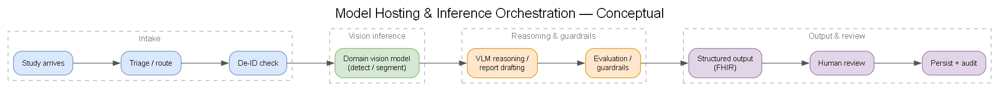
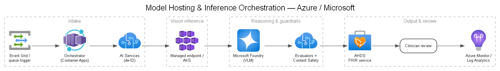

# 06 — Model Hosting & Orchestration

## What needs hosting

| Model type | Examples | Typical hosting |
|---|---|---|
| Frontier VLMs (managed) | OpenAI GPT-4o/GPT-5-class, Anthropic Claude | **Foundry Models** serverless / managed API — no infra to run |
| Domain vision models (catalog) | MedImageInsight, CXRReportGen, medical embedding models | Foundry managed endpoint or self-hosted GPU endpoint |
| Company custom models | Hip/knee detection/segmentation, the validated prototype | **Managed online endpoint / AKS / Container Apps** (see DEC-06a) |

## Hosting options (summary)

See **[DEC-06a](../decisions/DEC-06a-model-hosting.md)** for full advantages/disadvantages:
- **Azure ML managed online endpoints** — fastest path for custom models, built-in versioning/rollout.
- **Azure Kubernetes Service (AKS)** — maximum control, complex orchestration, mature GPU scaling.
- **Azure Container Apps** — serverless containers, scale-to-zero, simpler than AKS.
- **Foundry serverless / managed** — for catalog & frontier models, consumption-billed.

GPU SKU selection and serverless-vs-provisioned throughput are covered in **[DEC-06b](../decisions/DEC-06b-compute-gpu.md)**.

## Orchestration

The clinical inference flow is **multi-step**, not a single model call:

> Generated from [`diagrams/inference-flow.yaml`](./diagrams/inference-flow.yaml).

Orchestration options (see **[DEC-14](../decisions/DEC-14-orchestration-framework.md)**):
- **Microsoft Foundry Agent Service** — managed agent runtime, tool-calling, tracing.
- **Microsoft Agent Framework** — code-first orchestration in .NET/Python (unifies the former Semantic Kernel and AutoGen).
- **LangGraph** — flexible open-source multi-agent framework.

## Deployment & rollout patterns

- **Blue/green + canary** on endpoints; shift traffic % after eval gates pass.
- **Model registry** as source of truth (version, lineage, approval status).
- **Shadow mode** — run new model alongside production, compare, before promoting.
- **Rollback** is a one-click traffic shift, not a redeploy.

## Registry & Foundry cross-visibility

Microsoft Foundry is built on the **Azure Machine Learning** backbone, so the two share the same model/asset model — but cross-visibility depends on how you register and which project type you use:

- **Register to a shared registry, not just workspace-local.** A model promoted to an Azure ML **registry** (rather than a single workspace) is discoverable and deployable across workspaces and Foundry projects; a workspace-local model is only referenceable from that one workspace.
- **Project type matters.** **Hub-based Foundry projects** sit directly on an Azure ML workspace/hub and share its registry and assets natively — the cleanest path when a model trained or hosted in Azure ML must also be referenced from Foundry. Newer standalone **Foundry projects** are Microsoft's recommended default for agent/generative work and reference Azure ML models through the shared **registry** rather than natively. New features are being directed to Foundry projects; choose hub-based only where tight Azure ML co-visibility or existing governance requires it.
- The registry stays the source of truth for version, lineage, evaluation evidence, and approval state across both surfaces. See **[DEC-06a](../decisions/DEC-06a-model-hosting.md)** and evaluation in [`docs/13`](./13-evaluation-practices.md).

## Scaling

- Autoscale on GPU utilization / queue depth.
- Scale-to-zero for spiky research workloads (Container Apps / serverless).
- Provisioned throughput (PTUs) for predictable, latency-sensitive clinical paths (see [`docs/18`](./18-readiness-model-access-quota.md)).

## Latency & throughput targets (to be set with Company)

- Interactive (clinician-in-loop): target p95 end-to-end < a few seconds for VLM steps.
- Batch/research: throughput-optimized, cost-first.
- Capture agreed SLOs in the SOW.

## Payload routing & multi-tenant backend

How real-time vs. batch and multimodal payloads (image / +text / +tabular) are routed to these hosting options, and how compute is pooled and right-sized across health-system tenants, is covered in [`docs/07`](./07-payload-processing-backend-alignment.md) and **[DEC-07](../decisions/DEC-07-backend-alignment.md)**.
