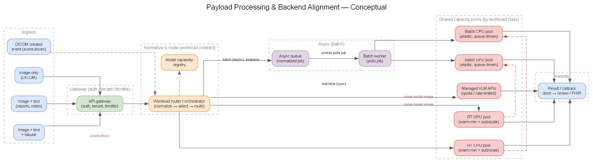
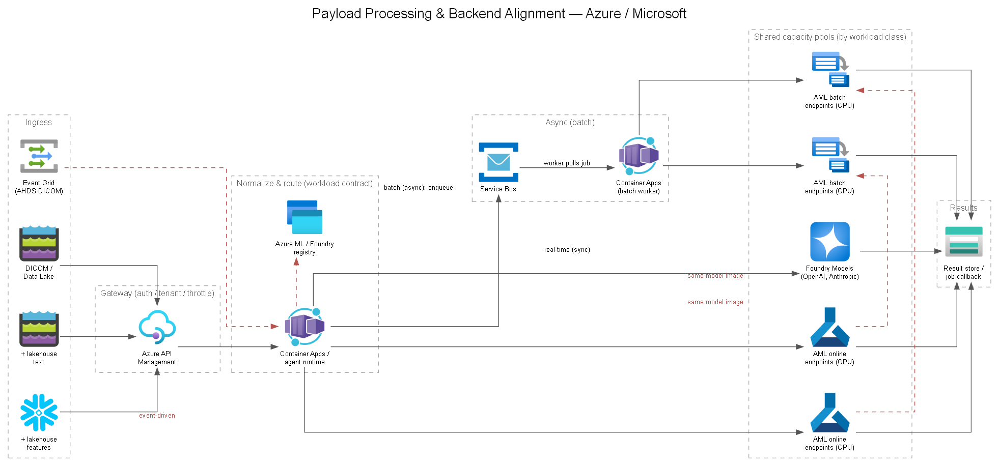

# 07 — Payload Processing & Backend Alignment

## Purpose

Company runs a **multi-modal, multi-modal-timing** workload: DICOM images are processed **in real time** (clinician-in-loop, latency-sensitive) or **in batch** (throughput- and cost-oriented), **with or without** linked text (reports/notes) and tabular data (structured findings/features). This doc defines the input-payload taxonomy, how the architecture **routes** each payload to the right processing path, and how each path maps to **aligned, right-sized backend resources** — including a **shared, multi-tenant** backend serving multiple health-system customers.

It ties together hosting ([`docs/06`](./06-model-hosting-orchestration.md)), model strategy ([`docs/08`](./08-ai-foundry-model-strategy.md)), API exposure ([`docs/09`](./09-api-exposure.md)), and readiness/quota ([`docs/18`](./18-readiness-model-access-quota.md)). See **[DEC-07](../decisions/DEC-07-backend-alignment.md)** for the backend-alignment & multi-tenant compute-pooling decision.

## Payload taxonomy

Two independent axes — **timing** (real-time vs. batch) and **modality composition** (what's in the payload) — give six processing types:

| Timing → / Payload ↓ | **Real-time (sync)** | **Batch (async)** |
|---|---|---|
| **Image-only** (DICOM) | Vision/VLM call on a study; sub-few-second target | Bulk scoring of study backlogs / cohorts |
| **Image + text** (reports, notes) | Image models + text-grounded VLM; combine outputs | Bulk multimodal scoring with report context |
| **Image + text + tabular** (features) | Image + text + a tabular/LLM model fusing structured features | Bulk multimodal + tabular fusion over cohorts |

The **modality composition determines which backends are invoked**; the **timing determines the execution path and the compute pool** those backends run on.

## Routing





> Generated from [`diagrams/payload-routing.yaml`](./diagrams/payload-routing.yaml).

The guiding principle is to **route by workload contract, not just by payload type**. Ingress normalizes every request into a **workload descriptor**, and the router resolves it to a workload class and a processing graph:

**request → workload class → processing graph → required backend class**

### Routing attributes

The router inspects several attributes, not only the modality:

| Routing attribute | Examples | Backend implication |
|---|---|---|
| **Latency SLA** | 2 s / 30 s / minutes | sync online vs. async queue/batch |
| **Payload** | image; image+text; image+text+tabular | VLM vs. multimodal pipeline vs. ensemble |
| **Model requirement** | GPT/Claude/VLM; fine-tuned LLM; tabular model | Foundry vs. Azure ML GPU/CPU |
| **Compute need** | CPU, small GPU, large GPU | deployment / compute pool |
| **Request size** | 1 image vs. 3,000-study batch | online endpoint vs. queued job |
| **Tenant** | health system A / B / C | quota, priority, isolation policy |

### Workload classes → processing graphs

- **RT + image-only** → VLM or Azure ML vision endpoint.
- **RT + image + text** → VLM, optionally followed by a structured model.
- **RT + image + text + tabular** → orchestrated multi-model call (image + text + tabular fusion).
- **Batch + any combination** → Service Bus / job manifest → Azure ML batch or scalable worker pool.

### Execution paths

1. **Ingress (auth, not routing).** Requests enter through **Azure API Management** ([`docs/09`](./09-api-exposure.md)), which authenticates, identifies the tenant, applies throttling/quotas and request-size limits, and **forwards** to the orchestrator — it does **not** decide real-time vs. batch. DICOM landing in Azure Health Data Services can additionally emit **`DicomImageCreated`** events via **Event Grid**, triggering the orchestrator **without** an API call ([events overview](https://learn.microsoft.com/en-us/azure/healthcare-apis/events/events-overview)).
2. **Normalize, then decide (in the orchestrator).** The **Container Apps orchestrator** normalizes whatever arrived into a common workload descriptor and reads its `mode` / `latency_sla` to choose the path. The rt-vs-batch decision lives **here**, after normalization — not at the gateway.
3. **Real-time path (sync).** For interactive requests the orchestrator composes the processing graph **inline** over **synchronous online endpoints** ([`docs/06`](./06-model-hosting-orchestration.md)) and returns a schema-validated result within the latency budget. Online endpoints also support an async-inference mode (submit-and-poll) for medium-latency models that still don't warrant batch ([online endpoints](https://learn.microsoft.com/en-us/azure/machine-learning/concept-endpoints-online?view=azureml-api-2)).
4. **Batch path (async).** For high-throughput requests the orchestrator **enqueues the normalized job** on **Azure Service Bus** (durable decoupling and **queue-based load leveling** — [pattern](https://learn.microsoft.com/en-us/azure/architecture/patterns/queue-based-load-leveling)) and returns a **job handle**; a **batch worker** drains the queue (competing consumers) and drives **Azure ML batch endpoints**, writing to a **result/callback store** — no synchronous gateway timeout. Because the orchestrator normalizes *before* enqueuing, the queue message is the normalized descriptor. The full async chain is:

   **APIM → orchestrator (normalize) → Service Bus → batch worker → Azure ML batch → callback / result store**

   Batch endpoints are the asynchronous counterpart to online endpoints, parallelizing over compute clusters and deallocating when idle ([batch endpoints](https://learn.microsoft.com/en-us/azure/machine-learning/concept-endpoints-batch?view=azureml-api-2)).


### Capability-based backend selection

The **Container Apps / agent runtime is the workload router/orchestrator — not the compute scheduler.** "Normalize workload descriptor" is a **small application function at the ingress↔orchestration boundary**, not a separate Azure product: it takes whatever arrived via APIM / Event Grid / Service Bus and converts it into one common internal job schema, regardless of modality:

```text
tenant_id
request_id
mode: realtime | batch
payload:
  images:  [...]
  text:    [...]
  tabular: [...]
requested_task: classify | segment | summarize | ...
latency_sla
model/pipeline_id
priority
callback/result_location
```

The orchestrator then reasons over that descriptor — e.g. *"RT + image+text + 3 s SLA + pipeline X"* → call Foundry VLM, pass its result plus tabular features to an Azure ML online model, compose the result. Endpoint URLs and capacity assumptions live in a **model/backend capability registry**, not in orchestration code:

| Capability | Backend |
|---|---|
| VLM-A, VLM-B | Foundry deployment |
| chest-xray-v7 | Azure ML online **GPU** pool |
| risk-model-v4 | Azure ML online **CPU** pool |
| segmentation-v12 | Azure ML batch **GPU** pool |

**Responsibility split** — keep modality/pipeline reasoning out of APIM policies; once you're reasoning about payload composition, model requirements, and processing graphs, you're in application logic:

| Component | Responsibility |
|---|---|
| **API Management** | Authentication, tenant identification, API contract, throttling, request-size limits — then forward to the orchestrator. Simple header/tenant decisions only; **no rt-vs-batch or modality routing**. |
| **Container Apps orchestrator/router** | Validate payload, resolve references to DICOM/blob/lakehouse objects, **normalize the workload descriptor**, select the processing graph, invoke the appropriate backend(s). |
| **Service Bus** | Carries the normalized descriptor as the message for asynchronous/batch workloads. |
| **Azure ML / Foundry** | Execute inference — **not** application-level routing. |

This keeps the same architecture handling all six RT/batch × modality combinations without hard-coding six pipelines: **ingress → normalize workload descriptor → policy/router → processing graph → capability-based backend selection → shared capacity pools → results.**

## Backend alignment

Processing is a **mix** of managed frontier VLM calls and self-hosted trained/fine-tuned open-source models — each payload/timing combination maps to specific backends and compute:

| Backend | What it serves | Hosting | Real-time compute | Batch compute |
|---|---|---|---|---|
| **Managed VLM APIs** | Frontier vision-language (report drafting, grounding, reasoning) | **Foundry Models** — OpenAI, Anthropic (managed, no infra) | **PTU** for clinical latency, else consumption | Consumption (throughput-first) |
| **Domain / custom vision models** | Hip/knee detection & segmentation, medical embeddings | **Azure ML online endpoints** (GPU) | Reserved/min-instance GPU pool | Same model image on **spot / scale-to-zero** batch pool |
| **Fine-tuned OSS tabular / LLM models** | Tabular fusion, structured-feature models, small OSS LLMs | **Azure ML endpoints** (GPU or CPU) | Warm GPU/CPU pool | Spot / scale-to-zero batch pool |
| **Batch compute pool** | Bulk scoring of any of the above | **Azure ML batch / Azure Batch** | — | Spot GPU, scale-to-zero |

Key alignment rules:

- **Same model, two runtimes.** A custom or fine-tuned model is packaged once (registry) and served both as a **warm real-time endpoint** and on the **batch pool** — the batch path reuses the same container image on cheaper, evictable compute.
- **Managed vs. self-hosted is a per-step choice, not per-request.** A single request can fan out to a managed VLM *and* a self-hosted vision/tabular model; the orchestrator composes their outputs.
- **Timing picks the compute profile.** Real-time paths use **reserved / min-instance / PTU** capacity for predictable latency; batch paths use **spot / scale-to-zero** for cost. GPU/throughput sizing is in **[DEC-06b](../decisions/DEC-06b-compute-gpu.md)**.

## Shared multi-tenant backend

Company serves **multiple health-system customers** from a shared backend rather than standing up per-customer infrastructure. The key design choice is to **pool capacity by workload class, not by customer**, and allocate tenants through **logical quotas, priorities, and concurrency limits** — reserving customer-dedicated stacks only where contractual isolation requires it. See **[DEC-07](../decisions/DEC-07-backend-alignment.md)** for the options and trade-offs, and the SaaS tenancy model in [`docs/17`](./17-saas-path.md).

**Pools by workload class:**

| Pool | Profile |
|---|---|
| **RT GPU pool** | Warm minimum capacity + autoscale — latency-sensitive GPU inference |
| **RT CPU pool** | Warm minimum capacity + autoscale — latency-sensitive CPU inference (e.g. tabular) |
| **Batch GPU pool** | Elastic, queue-driven, spot / scale-to-zero |
| **Batch CPU pool** | Elastic, queue-driven, spot / scale-to-zero |
| **Foundry capacity** | Quota / rate-limited shared managed-model deployments |

**Tenancy controls (applied on top of the shared pools):**

| Concern | Approach |
|---|---|
| **Tenant isolation** | Tenant identity flows from Entra/APIM through orchestration; **de-identified inputs by default**; data partitioned per tenant in the lakehouse ([`docs/04`](./04-data-platform-design.md)); no cross-tenant data in a shared request. |
| **Noisy-neighbor control** | Per-tenant **rate limits / quotas / concurrency limits** at APIM; priority classes so real-time clinical traffic preempts batch. |
| **Fairness & scheduling** | Interactive vs. batch pools are physically separate so a large batch job can't starve clinician-in-loop latency. |
| **Cost allocation** | Per-tenant tagging + token/GPU-hour metering for chargeback/showback ([`docs/16`](./16-roadmap-prod-commercialization.md), [`docs/17`](./17-saas-path.md)). |
| **Dedicated on request** | Peel off dedicated/reserved real-time capacity for large or regulatory-constrained tenants without changing the shared-by-default model. |

## Provisioning & right-sizing the backend

Size each pool to its **workload shape**, not a single global number. For each workload class, measure four things:

**arrival rate × service time × concurrency × resource footprint**

- **Real-time pools** — size from **peak concurrency × per-request model time × latency target**. Keep a **warm minimum** (min-instances ≥ 1) to avoid cold starts on clinical paths; autoscale on GPU utilization / queue depth / request concurrency. Use **PTU** for latency-sensitive managed-VLM steps ([`docs/18`](./18-readiness-model-access-quota.md)).
- **Batch pools** — size for **throughput/cost**: **spot GPUs** with **scale-to-zero**, max-node caps, and checkpoint/retry for eviction tolerance. Backlog depth drives node count.
- **Managed VLM capacity** — consumption for spiky/dev; **PTU** reserved for predictable clinical latency. Track **TPM/RPM** per tenant.
- **Per-tenant headroom** — request **quota** (GPU cores, TPM/RPM) for aggregate peak across tenants, plus headroom; requesting quota is free — request 2–3× the minimum ([`docs/18`](./18-readiness-model-access-quota.md)).
- **Right-sizing loop** — benchmark real models before committing SKUs; monitor utilization, latency, and cost per tenant ([`docs/10`](./10-monitoring-observability.md)) and adjust pool sizes and reservation vs. spot mix.

**GPU capacity is not "requests/sec."** An MRI study invoking a segmentation model can consume orders of magnitude more **GPU-seconds** than a single tabular scoring request. For GPU pools especially, capture **GPU utilization, GPU memory, queue depth, request latency, and model-loading time** — and plan capacity in GPU-seconds per workload class, not raw request counts.

Sizing inputs to gather with Company:

- studies/day and peak studies/hour per tenant, split by **real-time vs. batch**;
- payload mix (share of image-only vs. +text vs. +tabular);
- per-model inference time and target p95 latency for interactive paths;
- batch completion windows (e.g., overnight cohort scoring); and
- tenant count and growth, for aggregate quota and pool sizing.

## Interfaces

- **From API exposure** ([`docs/09`](./09-api-exposure.md)): sync vs. job-based contracts, per-tenant auth and throttling.
- **To hosting/orchestration** ([`docs/06`](./06-model-hosting-orchestration.md)): endpoint deployments, rollout, and the orchestration graph.
- **To model strategy** ([`docs/08`](./08-ai-foundry-model-strategy.md)): which managed vs. self-hosted models compose each payload type.
- **To readiness/quota** ([`docs/18`](./18-readiness-model-access-quota.md)) and **compute** (**[DEC-06b](../decisions/DEC-06b-compute-gpu.md)**): GPU/PTU sizing and quota requests.
- **To SaaS** ([`docs/17`](./17-saas-path.md)): tenant isolation, metering, and cost allocation.

## Related decisions

- **[DEC-07](../decisions/DEC-07-backend-alignment.md)** — Backend alignment & multi-tenant compute pooling
- **[DEC-06a](../decisions/DEC-06a-model-hosting.md)** — Custom-model hosting
- **[DEC-06b](../decisions/DEC-06b-compute-gpu.md)** — Compute / GPU strategy
- **[DEC-08a](../decisions/DEC-08a-vlm-selection.md)** — Vision-language model selection
- **[DEC-09](../decisions/DEC-09-api-exposure.md)** — API exposure / gateway
