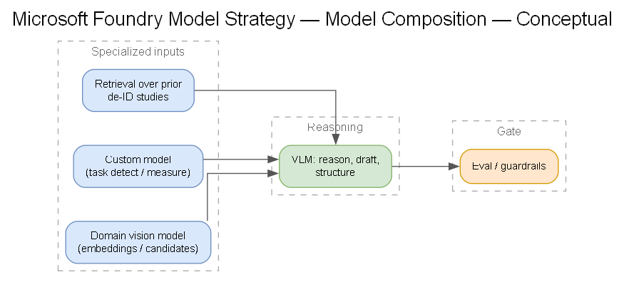
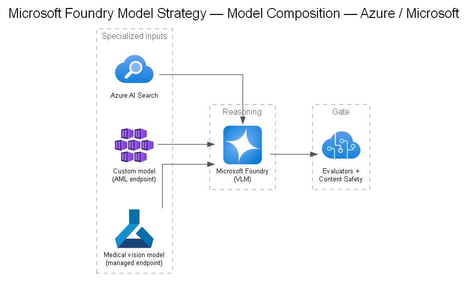

# 08 — Microsoft Foundry Model Strategy

## Objective

Validate the **right mix** of models on Microsoft Foundry for hip-and-knee imaging: frontier vision-language models, domain-specific medical vision models, and Company's custom models — plus how they're evaluated and orchestrated.

## The model portfolio

### 1. Frontier vision-language models (VLMs)
- **OpenAI GPT-4o / GPT-5-class** and **Anthropic Claude** (available via Foundry Models).
- Strengths: multimodal reasoning, report drafting, following complex instructions, structuring outputs.
- Role: reasoning/orchestration layer, drafting structured findings, summarization, QA — **not** the primary pixel-level detector.
- Readiness dependency: **access + quota** (see [`docs/18`](./18-readiness-model-access-quota.md)).

### 2. Domain-specific medical vision models
- Foundry **model catalog** includes healthcare imaging foundation models (e.g., **MedImageInsight** for embeddings/classification, **CXRReportGen**, medical image segmentation models).
- Strengths: trained on medical imagery; strong embeddings, retrieval, and specialized tasks.
- Role: feature extraction, similarity/retrieval, candidate detection feeding the custom + VLM layers.
- **Reference implementations:** Microsoft's [**healthcareai-examples**](https://github.com/microsoft/healthcareai-examples) repo has runnable notebooks for each catalog model — see the table below.

## Reference: Microsoft healthcare AI examples

The [`microsoft/healthcareai-examples`](https://github.com/microsoft/healthcareai-examples) repo (research/model-development samples — **not** clinical-ready) is the fastest way to trial the catalog models that feed this strategy. Directly relevant patterns:

| Model / pattern | What it demonstrates | Link |
|---|---|---|
| **MedImageInsight** (MI2) | Deploy the image+text embedding foundation model | [deploy](https://aka.ms/healthcare-ai-examples-mi2-deploy) |
| **MedImageParse** (MIP) | Deploy the medical image segmentation model | [deploy](https://aka.ms/healthcare-ai-examples-mip-deploy) · [call patterns](https://github.com/microsoft/healthcareai-examples/blob/main/azureml/medimageparse/medimageparse_segmentation_demo.ipynb) |
| **CXRReportGen** (CXR) | Deploy chest X-ray report generation | [deploy](https://aka.ms/healthcare-ai-examples-cxr-deploy) |
| **Providence-GigaPath** (PGP) | Histopathology embedding model | used in [rad-path demo](https://github.com/microsoft/healthcareai-examples/blob/main/azureml/advanced_demos/radpath/rad_path_survival_demo.ipynb) |
| Zero-shot classification | Classify images with MI2 text/image encoders (no training) | [notebook](https://github.com/microsoft/healthcareai-examples/blob/main/azureml/medimageinsight/zero-shot-classification.ipynb) |
| Adapter training | Train lightweight task adapters on MI2 embeddings | [notebook](https://github.com/microsoft/healthcareai-examples/blob/main/azureml/medimageinsight/adapter-training.ipynb) |
| Fine-tuning (MI2) | Full AzureML fine-tuning pipeline | [notebook](https://github.com/microsoft/healthcareai-examples/blob/main/azureml/medimageinsight/finetuning/mi2-finetuning.ipynb) |
| Advanced calling patterns | Concurrency, batching, efficient preprocessing | [notebook](https://github.com/microsoft/healthcareai-examples/blob/main/azureml/medimageinsight/advanced-call-example.ipynb) |

These map onto Company's portfolio: **zero-shot / adapter** patterns validate whether catalog models help before any training ([DEC-08b](../decisions/DEC-08b-domain-vision-models.md)); **fine-tuning** informs the domain-adaptation path; **rad-path** shows multimodal composition. See also [`docs/13`](./13-evaluation-practices.md) and [`docs/14`](./14-agentic-orchestration.md) for eval- and agent-oriented examples.

### 3. Company custom models
- The **validated hip-and-knee prototype** — the crown jewel.
- Role: primary task-specific detection/segmentation/measurement.
- Path: register in model registry, host per **[DEC-06a](../decisions/DEC-06a-model-hosting.md)**, evaluate continuously.

### 4. Fine-tuning / adaptation
- Consider fine-tuning or LoRA adaptation of VLMs on de-identified report/label pairs if generic VLMs underperform on Company's phrasing/templates.
- Weigh against maintenance + governance cost. Capture as a decision if pursued.

## Composition pattern

> Generated from [`diagrams/model-strategy.yaml`](./diagrams/model-strategy.yaml).

The VLM **orchestrates and communicates**; the specialized models **do the pixel-level work**. This is the core of the AI platform strategy.

## Model-strategy decisions to capture

- **[DEC-08a](../decisions/DEC-08a-vlm-selection.md)** — which frontier VLM(s): OpenAI vs. Anthropic vs. both (multi-model).
- **[DEC-08b](../decisions/DEC-08b-domain-vision-models.md)** — which domain vision models / whether to use catalog foundation models vs. build.
- Fine-tune vs. prompt-engineer vs. RAG for domain adaptation.

## Evaluation & agentic orchestration

- Evaluation practices: [`docs/13`](./13-evaluation-practices.md).
- Agentic orchestration: [`docs/14`](./14-agentic-orchestration.md).

## Why Microsoft Foundry as the platform

- Single catalog spanning OpenAI, Anthropic, Meta, and healthcare-specific models.
- Built-in **evaluation**, **tracing/observability**, **content safety**, and **agent service**.
- Managed + serverless deployment options; enterprise networking (Private Link) and Entra governance.
- Keeps model strategy portable across providers instead of locking into one model vendor.
