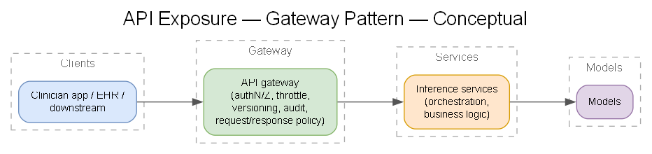
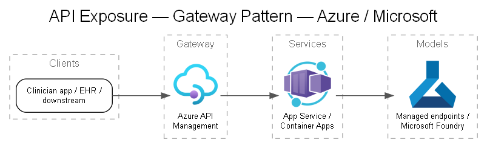

# 09 — API Exposure

## Objective

Expose the imaging-AI capability to clinician apps and downstream systems securely, with governance, versioning, throttling, and audit.

## Pattern

> Generated from [`diagrams/api-exposure.yaml`](./diagrams/api-exposure.yaml).

Recommended: **Azure API Management (APIM)** as the front door in front of App Service / Container Apps / AKS-hosted services. See **[DEC-09](../decisions/DEC-09-api-exposure.md)**.

## API responsibilities

- **AuthN/Z:** Entra ID (OAuth2/OIDC), scopes/roles per caller; managed identity to backends.
- **Rate limiting & quotas:** protect models, control cost, per-tenant fairness (SaaS-ready).
- **Versioning:** stable contracts; deprecate safely.
- **Validation & transformation:** schema validation, request shaping, response filtering.
- **Audit:** log every request (who, what study, what model version, outcome) → audit store.
- **Content safety hooks:** enforce guardrails on generative outputs.

## Interface style

- **Sync REST** for interactive clinician requests (submit study → structured findings).
- **Async / job-based** for long-running batch inference (submit → poll/callback).
- **FHIR-shaped outputs** where results feed clinical systems (e.g., DiagnosticReport, Observation, ImagingStudy references).

## Multi-tenancy (SaaS path)

- Tenant isolation at the API layer (tenant claim → data/model scoping).
- Per-tenant rate limits, metering (for billing), and configuration.
- See [`docs/17`](./17-saas-path.md).

## Security posture

- Private ingress; WAF (Application Gateway / Front Door) for public-facing edges.
- No PHI in URLs/query strings or logs; scrub before logging.
- mTLS / private link to backends.
