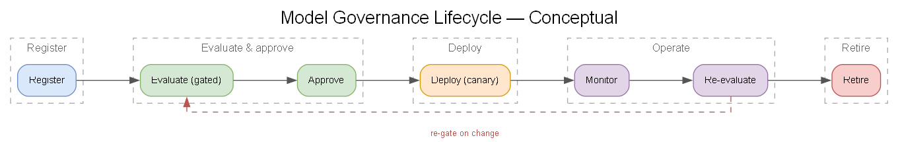
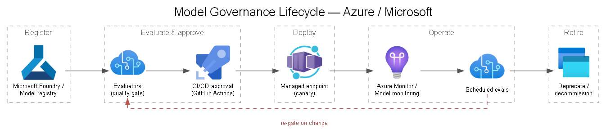

# 11 — Governance, Compliance & Security

## Regulatory context

Company operates a **healthcare/PHI** workload. The platform must support **HIPAA** (US) obligations and, for a SaaS path, additional frameworks (**HITRUST**, **SOC 2**, potentially **GDPR** for non-US). Clinical AI may also invoke **FDA/SaMD** considerations — a Company/regulatory responsibility, noted as a dependency.

> Microsoft offers a **HIPAA Business Associate Agreement (BAA)** covering in-scope Azure services. Confirm the BAA and that every PHI-touching service is in-scope. This is a gating governance item.

## PHI handling (see also [`docs/03`](./03-phi-detection-deidentification.md))

- De-identify early; minimize PHI footprint; segregate re-ID keys.
- PHI encrypted at rest (customer-managed keys optional) and in transit.
- Private networking for all PHI data-plane traffic.
- No PHI in logs, telemetry, prompts sent to lower environments, or model training sets unless explicitly governed.

## Secure AI patterns

- **Grounding & guardrails:** Azure AI Content Safety on generative outputs; prompt-injection defenses for agentic flows.
- **Least privilege:** managed identities, scoped RBAC, no shared keys.
- **Human-in-the-loop:** clinician review before any result influences care; AI is assistive.
- **Output constraints:** structured/validated outputs; refuse-on-uncertainty patterns.
- **Data boundary:** ensure model providers don't train on Company data (Azure OpenAI/Foundry data-handling commitments — confirm per model).

## Model lifecycle management (MLOps/LLMOps)

> Generated from [`diagrams/model-lifecycle.yaml`](./diagrams/model-lifecycle.yaml).

- **Model registry** = source of truth (version, lineage, training data version, approval).
- **Change control:** model/prompt updates are governed changes with eval evidence and sign-off.
- **Reproducibility:** dataset version ↔ model version ↔ eval run ↔ deployment all linked.
- **Rollback** defined and tested.

## Auditability

- Immutable audit of data access, de-ID, re-ID (privileged), predictions, and human decisions ([`docs/10`](./10-monitoring-observability.md)).
- Retention aligned to regulatory requirements (define with Company).
- Traceability sufficient for incident response and regulatory inquiry.

## Governance tooling on Azure

| Concern | Service |
|---|---|
| Policy & guardrails | Azure Policy, landing-zone controls |
| Security posture / compliance dashboard | Microsoft Defender for Cloud |
| Data catalog / classification / lineage | Microsoft Purview |
| Secrets / keys | Azure Key Vault (CMK, purge protection) |
| Identity | Microsoft Entra ID (PIM for privileged access) |
| Responsible AI | Azure AI Content Safety, Foundry evaluations |

## Decisions to capture

- Compliance target set (HIPAA-only vs. + HITRUST/SOC 2 for SaaS).
- Data residency / sovereignty requirements and region(s).
- Customer-managed keys (CMK) yes/no.
- Re-identification policy per use case.
- Retention periods for PHI, audit logs, and model artifacts.

## Responsibilities (RACI to finalize in SOW)

| Item | Company | Microsoft | Partner |
|---|---|---|---|
| Clinical validation / regulatory | A/R | C | C |
| Azure guardrails / landing zone | C | C | R |
| De-ID implementation & QA | A | C | R |
| Model lifecycle governance | A | C | R |
| BAA / compliance attestation | A | R | C |
