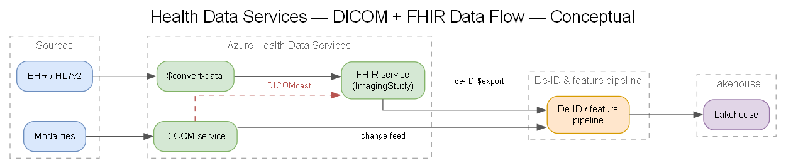
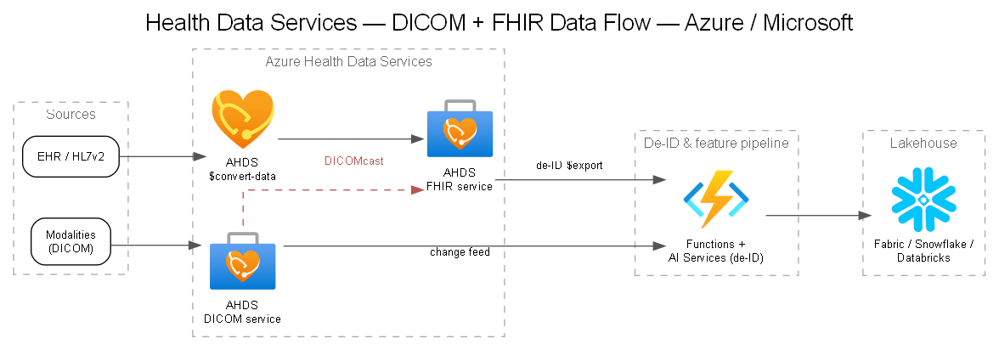

# 12 — Azure Health Data Services (FHIR & DICOM)

## Why AHDS

**Azure Health Data Services (AHDS)** is Microsoft's managed, HIPAA-eligible platform for health data, providing **FHIR service**, **DICOM service**, and **MedTech/de-ID** capabilities under one workspace with unified identity and networking. It is the recommended backbone for Company's imaging + clinical data.

## DICOM service

- Managed **DICOMweb** (STOW-RS / WADO-RS / QIDO-RS) store for imaging.
- **Change feed** for event-driven downstream processing (trigger de-ID, feature extraction, inference).
- **DICOMcast** projects imaging metadata into FHIR as `ImagingStudy`, linking images ↔ patient/clinical context.
- Scales storage separately from the app; standards-based so PACS/modalities interoperate.

## FHIR service

- Managed **FHIR R4** store for clinical/multimodal context (patients, encounters, observations, diagnostic reports).
- **`$convert-data`** to transform HL7v2 (and others) → FHIR via Liquid templates.
- **`$export`** (bulk) for building de-identified research datasets, with de-ID configuration.
- SMART-on-FHIR + Entra for app auth.

## De-identification with AHDS

- Configurable anonymization for FHIR and DICOM (rule-driven, DICOM PS3.15 profiles).
- Supports date-shifting, redaction, and surrogate substitution — feeds the strategy in [`docs/03`](./03-phi-detection-deidentification.md).

## How AHDS fits the reference architecture

> Generated from [`diagrams/ahds-dataflow.yaml`](./diagrams/ahds-dataflow.yaml).

## Decision context

- **[DEC-02](../decisions/DEC-02-dicom-ingestion.md)** weighs AHDS DICOM vs. alternatives.
- For most healthcare imaging platforms on Azure, AHDS is the default; alternatives are considered where cost, existing PACS-in-cloud investments, or specific control needs dominate.

## Benefits for governance

- HIPAA-eligible, covered under Microsoft BAA (confirm scope).
- Private Link, Entra RBAC, audit logging built in.
- Standards-based interoperability reduces custom integration risk and supports the SaaS path (any FHIR/DICOM-capable customer can connect).
