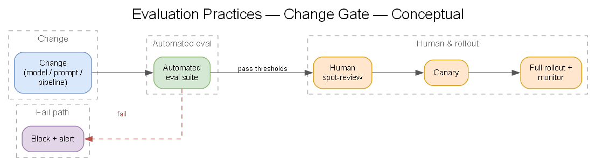
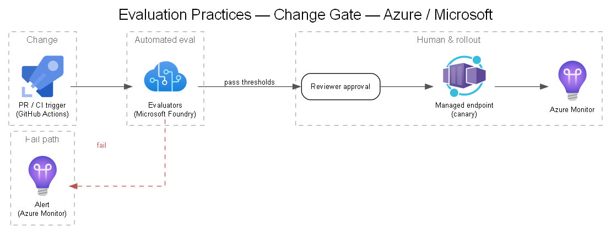

# 13 — Evaluation Practices

Evaluation is the gate between "interesting demo" and "trustworthy clinical tool." It must be **continuous, versioned, and gated**.

## What to evaluate

| Layer | Metrics |
|---|---|
| Domain vision / custom model | Sensitivity/specificity, AUROC, Dice/IoU (segmentation), measurement error vs. ground truth |
| VLM report/reasoning | Factual correctness, completeness, hallucination rate, structure/format adherence, clinical agreement |
| End-to-end pipeline | Agreement with radiologist, override rate, turnaround time, failure modes |
| Safety | Content-safety violations, prompt-injection resistance, refusal correctness |

## Evaluation datasets

- **Versioned, de-identified** gold sets with radiologist-adjudicated ground truth.
- Stratified across relevant slices (pathology type, severity, demographics, device/modality) to surface bias and gaps.
- Held-out sets never used for training/prompt-tuning.

## Tooling on Azure

- **Microsoft Foundry evaluations** orchestrate and record eval runs — in the portal and via the `azure-ai-evaluation` SDK — and store results as first-class artifacts linked to model + dataset versions ([`docs/11`](./11-governance-compliance.md)). Foundry runs on the Azure ML backbone, so models registered to a shared registry are evaluable from either surface ([`docs/06`](./06-model-hosting-orchestration.md)).
- **Match the evaluator to the model shape:**
  - **Generative steps** (VLM report drafting, reasoning, chat-style outputs) — use the **built-in evaluators** (groundedness, relevance, coherence, fluency, similarity, plus safety/content-safety). These are LLM-oriented and work in both portal and SDK.
  - **Discriminative / custom imaging models** (e.g., the hip/knee detector or segmentation) — the packaged generative evaluators don't apply; bring **custom evaluators** (code-, prompt-, or endpoint-based) that compute clinical metrics (AUROC, sensitivity/specificity, Dice/IoU) through the same evaluation SDK. Foundry is where you orchestrate and record the run, not the source of the metric.
- **Evaluation needs something to score against.** Evaluate models exposed as **online endpoints** that return predictions (wire the endpoint into the eval flow) or score a batch offline; deployment shape (see [`docs/06`](./06-model-hosting-orchestration.md)) therefore drives how the eval is run.
- Automated eval runs in CI: model/prompt change → eval suite → **gate** on thresholds before promotion.

## Human-in-the-loop evaluation

- Radiologist review panels for qualitative assessment and edge cases.
- Inter-rater reliability tracking.
- Feedback loop: reviewer corrections become future eval/training data (governed).

## LLM-as-judge (use carefully)

- Useful for scaling qualitative report evaluation; **calibrate against human labels** and monitor judge drift. Never the sole gate for clinical claims.

## Reference examples

Microsoft's [healthcareai-examples](https://github.com/microsoft/healthcareai-examples) repo has patterns useful for building the data-quality and evaluation harness (research samples, not clinical-ready):

- [**Outlier detection**](https://github.com/microsoft/healthcareai-examples/blob/main/azureml/medimageinsight/outlier-detection-demo.ipynb) — encode CT/MR series with MedImageInsight and flag anomalous images/studies; useful for input data-quality gates and drift screening.
- [**Exam parameter detection**](https://github.com/microsoft/healthcareai-examples/blob/main/azureml/medimageinsight/exam-parameter-demo/exam-parameter-detection.ipynb) — infer acquisition parameters from pixels (when DICOM metadata is unreliable); helps stratify eval sets and catch protocol mismatches.
- [**Image search (2D/3D)**](https://github.com/microsoft/healthcareai-examples/blob/main/azureml/advanced_demos/image_search/2d_image_search.ipynb) — similarity retrieval over de-ID priors; supports building curated, stratified gold sets and finding edge cases.

## Gating policy (example)

> Generated from [`diagrams/evaluation-gate.yaml`](./diagrams/evaluation-gate.yaml).

## Continuous evaluation in production

- Sample production cases (de-identified) for ongoing quality measurement.
- Drift + performance-decay alerts feed back to retraining decisions ([`docs/10`](./10-monitoring-observability.md)).

## Decision to capture

- Metric thresholds and gates (clinical acceptance criteria) — set **with Company's clinical leads**.
