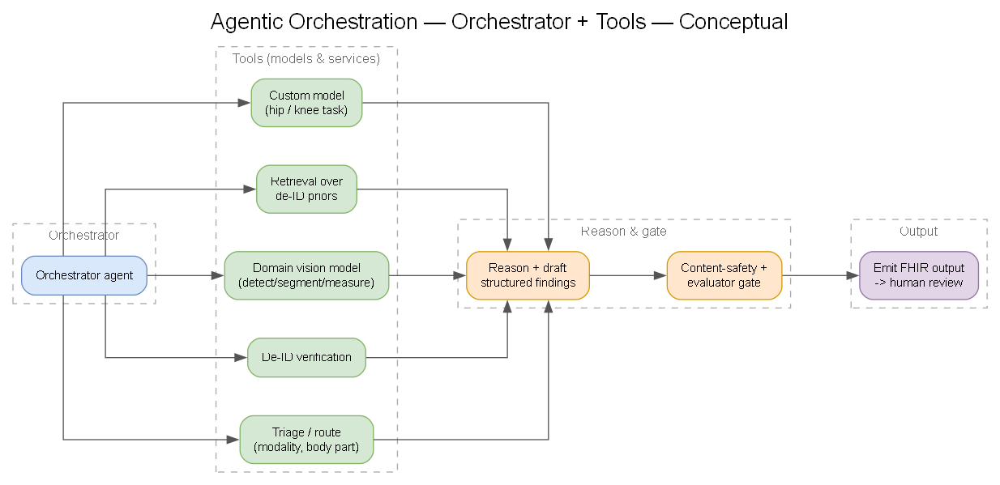
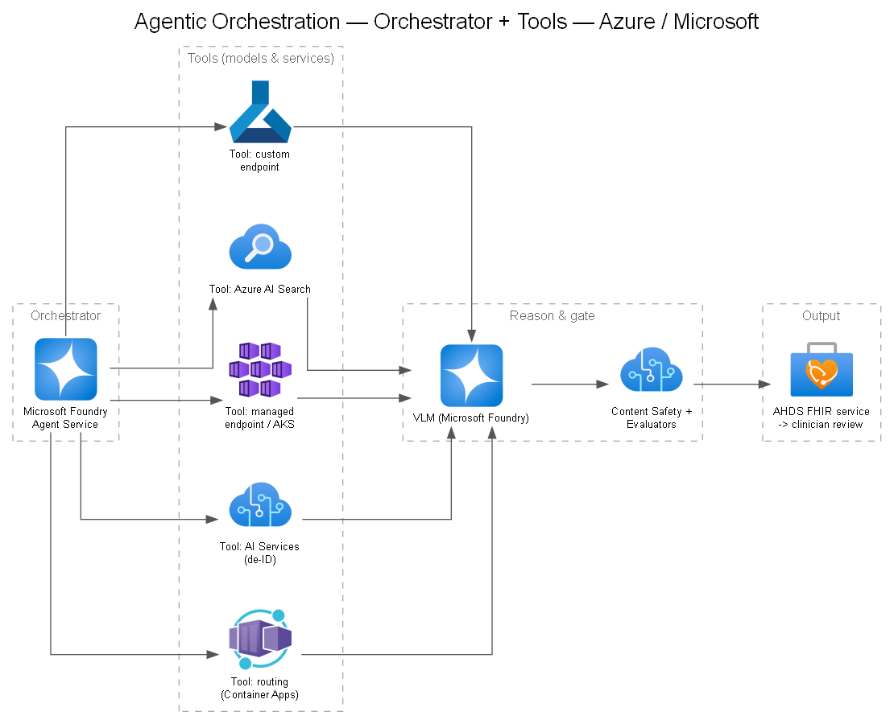

# 14 — Agentic Orchestration

## When agents add value

The imaging flow benefits from **orchestrated, multi-step reasoning with tool use**: routing studies, calling specialized vision models as tools, retrieving priors, drafting structured reports, and invoking guardrails/evaluators. An agentic layer coordinates these steps with tracing and control.

## Reference agentic flow

> Generated from [`diagrams/agentic.yaml`](./diagrams/agentic.yaml).

## Framework options

See **[DEC-14](../decisions/DEC-14-orchestration-framework.md)** for advantages/disadvantages:

- **Microsoft Foundry Agent Service** — managed agent runtime with tool-calling, threads, built-in tracing/observability, and enterprise governance. Lowest ops burden; tight Azure integration.
- **Microsoft Agent Framework** — code-first orchestration (Python/.NET) that unifies the former Semantic Kernel and AutoGen; fine-grained control, good for embedding in existing services.
- **LangGraph** — flexible open-source multi-agent graphs; most control, most to maintain and govern.

## Design principles for clinical agents

- **Determinism where it matters** — clinical steps should be reproducible; constrain tool outputs and validate.
- **No autonomous action on patient care** — agent produces assistive output; a human decides.
- **Guardrails at boundaries** — validate every tool input/output; prompt-injection defenses on any retrieved text.
- **Full trace** — every agent step, tool call, and decision logged for audit ([`docs/11`](./11-governance-compliance.md)).
- **Timeouts, retries, fallbacks** — degrade gracefully; never hang a clinical workflow.

## Prototype consideration

For the two-day prototype, start with a **thin orchestration** (Foundry Agent Service or a simple Microsoft Agent Framework pipeline) to prove the model composition, then decide on the production framework once flows stabilize.

## Reference examples

Microsoft's [healthcareai-examples](https://github.com/microsoft/healthcareai-examples) repo shows concrete agent patterns that wrap healthcare vision models as tools (research samples, not clinical-ready):

- [**MedImageInsight agentic plugin (MCP)**](https://github.com/microsoft/healthcareai-examples/tree/main/agentic/medimageinsight) — exposes MedImageInsight as **MCP tools** to a radiology report-writing agent with supporting skills. Closely mirrors the "specialized model as a tool" pattern above.
- [**Medical image classification agent**](https://github.com/microsoft/healthcareai-examples/blob/main/azureml/medimageinsight/agent-classification-example.ipynb) — a conversational agent that routes image-analysis tasks to MI2 embeddings via LLM function calls, managing conversation state — a template for the orchestrator + tool-calling design.
