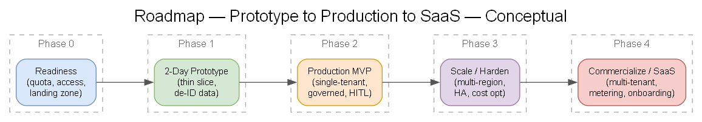
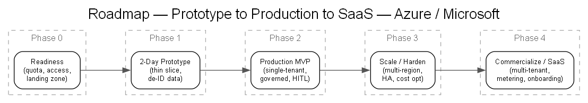

# 16 — Roadmap: Prototype → Production → Commercialization

## Phased roadmap

> Generated from [`diagrams/roadmap.yaml`](./diagrams/roadmap.yaml).

### Phase 0 — Readiness (now)
- Confirm model access + quota (OpenAI + Anthropic) — [`docs/18`](./18-readiness-model-access-quota.md).
- Confirm BAA scope, landing zone, subscription, funding alignment.
- Capture decisions in [`/decisions`](../decisions).

### Phase 1 — Two-day rapid prototype
- Validate the risky integration points ([`docs/15`](./15-two-day-prototype-scope.md)).
- Output: evidence + refined production plan + SOW inputs.

### Phase 2 — Production MVP (single-tenant)
- Full ingestion (production connectivity), robust de-ID with QA.
- Governed model lifecycle, evaluation gates, observability, audit.
- Human-in-the-loop clinical workflow for Company's own network.
- Partner-executed under SOW.

### Phase 3 — Scale & harden
- Multi-region/HA, autoscaling, cost optimization (PTUs vs. serverless).
- Performance SLOs, DR, operational runbooks.
- Expanded modality/pathology coverage.

### Phase 4 — Commercialization / SaaS
- Multi-tenant isolation, metering/billing, self-serve onboarding.
- Roll out across Company's physician network, then to other providers.
- See [`docs/17`](./17-saas-path.md).

## Ownership & execution

| Workstream | Owner (proposed) |
|---|---|
| Clinical validation & acceptance criteria | Company |
| Azure platform build & MLOps | Partner (SOW) |
| Model access, quota, funding programs | Microsoft |
| Governance, compliance, BAA | Company + Microsoft |
| Product/commercial (SaaS) | Company + Partner |

## Capacity & cost considerations

- **Compute:** GPU SKUs for custom/domain models; VLM consumption vs. provisioned throughput (PTUs) — [`docs/18`](./18-readiness-model-access-quota.md), [DEC-06b](../decisions/DEC-06b-compute-gpu.md).
- **Storage:** imaging volume growth (DICOM) — tiering strategy.
- **Cost levers:** scale-to-zero for research, PTUs for predictable clinical load, batch off-peak, right-sized GPUs.
- Build a **cost model** per study and per tenant early (drives SaaS pricing).

## Funding alignment

- Explore Microsoft funding/partner programs (e.g., Azure consumption commitments, ISV/marketplace support, AI-specific programs). Microsoft to advise; capture specifics in the SOW.

## Key milestones & exit criteria

| Milestone | Exit criteria |
|---|---|
| Prototype complete | End-to-end thin slice validated on de-ID data |
| Production MVP | Governed, audited, clinician-in-loop, meets clinical acceptance |
| Scale-ready | HA, SLOs met, cost within target |
| SaaS-ready | Multi-tenant, metered, onboarding repeatable |
